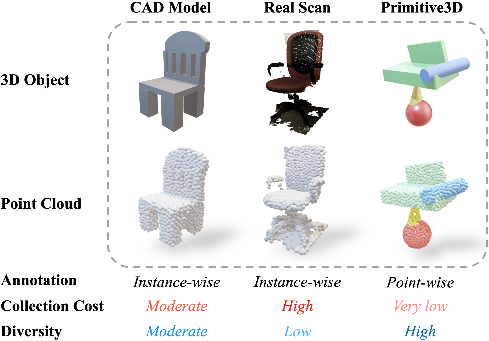

# Primtive3D Dataset
This REPO is for CVPR2022 Paper: *Primitive3D: 3D Object Dataset Synthesis from Randomly Assembled Primitives*
<div align="center">
	
</div>

We provide two data formats of Primitive3D dataset, namely, PLY data and H5DF data. PLY data contains a set of .ply files, each of which stands for a mesh of a Primitive3D object. Two extra information, **source** and **label**, is included in the *.ply* file, which are the segmentation labels. H5DF data stands for the *.h5* files that samples 8192 points for each object. Each *.h5* file contains the following keys and data:
* *data*: coordinates of points with shape (N $$\times$$ 8192 $$\times$$ 3)
* *sem_label*: asdasd.

If ones would like to generate their own datase, please refer to [`Data Generation`](#data-generation). Or one can download the pre-generated dataset with the links  in [`Data Generation`](#download-link).

## Installation
All experiments have been tested on Python 3.6 and CUDA10.2 environment.
### Requirements for Data Generation
**Install PyMesh：**
PyMesh can be install with the '.whl' files in the latest released [version 3.0](https://github.com/PyMesh/PyMesh/releases/tag/v0.3).

**Other dependencies：**
Other depent packages can be installed by the following command
```bash
pip install -r datagen_requirements.txt
```

## Data Generation
To generate Primitive3D dataset in '.h5' format, please run:
```bash
python gen_primitive3d.py
``` 
The dataset generation contains two step: 
* generate mesh-based objects with '.ply' formats in `./data/primitive3d_ply`. 
* generate point cloud with '.h5' format in `./data/primitive3d.h5`. 

User can change the default path by modify `gen_primitive3d.py`. Other modification can be done to determine the  statistics of dataset generation in this file. The default generated dataset is a small-scale dataset.


## Download Link
| Name |  PLY Link   | H5DF Link  | Description |
|  ----  | ----  |  ----  | ----  |
|Original|link|link|Origninal Generated dataset |
